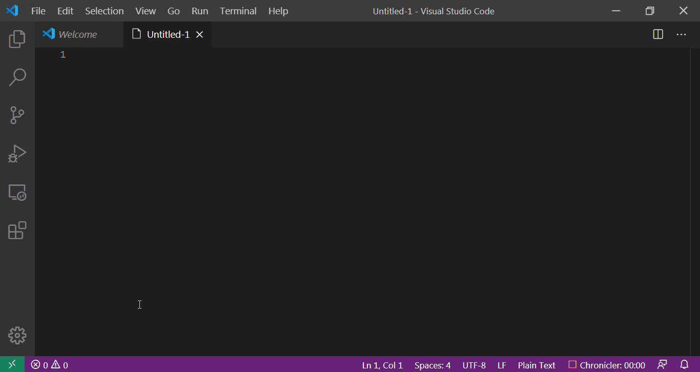

# License Snippets for VSCODE

This extension integrates license snippets into VS Code.

[See in Marketplace](https://marketplace.visualstudio.com/items?itemName=issammani.license-snippets)

## Features
- Insert license by typing `l-<license_SPDX_short_identifier>` (Ex. `l-MIT`, `l-0BSD`, `l-Apache-2.0`)
- A full list of supported licenses and SPDX short identifiers can be found [here](https://opensource.org/licenses/alphabetical)
- Snippets can be inserted in a variety of file types. (For a compelete list, see [List of supported languages](utils/language_ids.js))

## Contributing

You're feedback is always welcome, wether it's:

- Reporting a bug
- Discussing the current state of the code
- Submitting a fix
- Proposing new features

## Notes
- All licenses were scraped from [Open Source Initiative](https://opensource.org/licenses/alphabetical).
